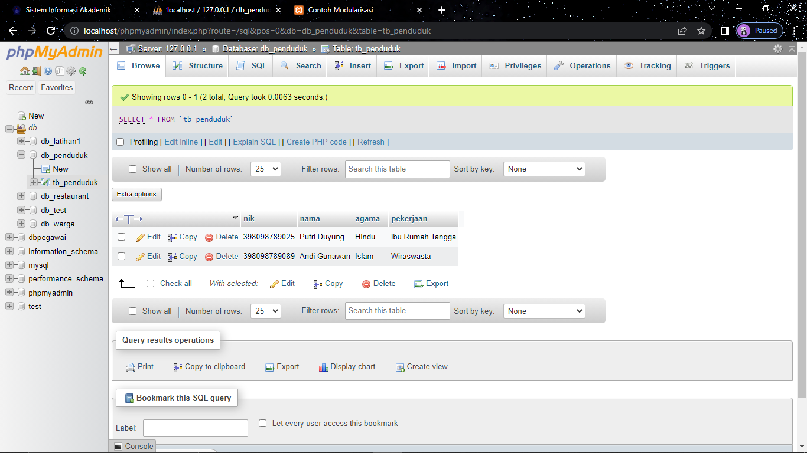
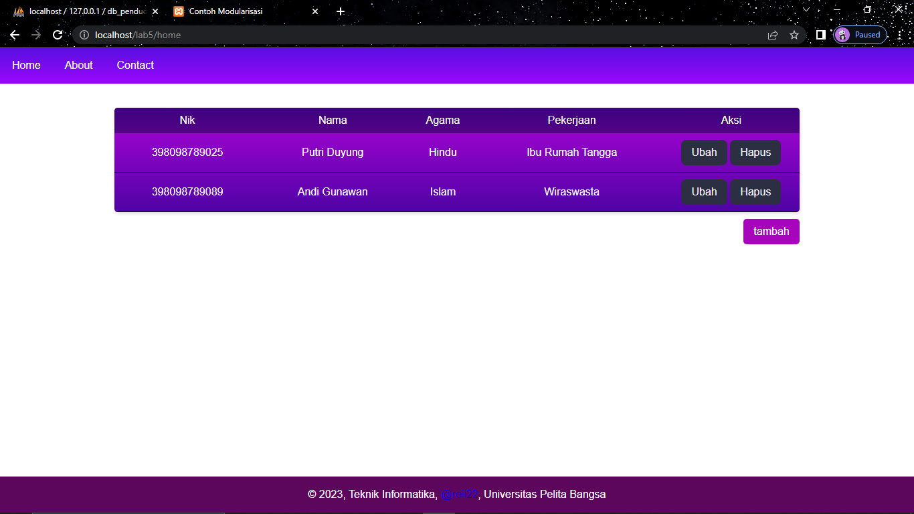
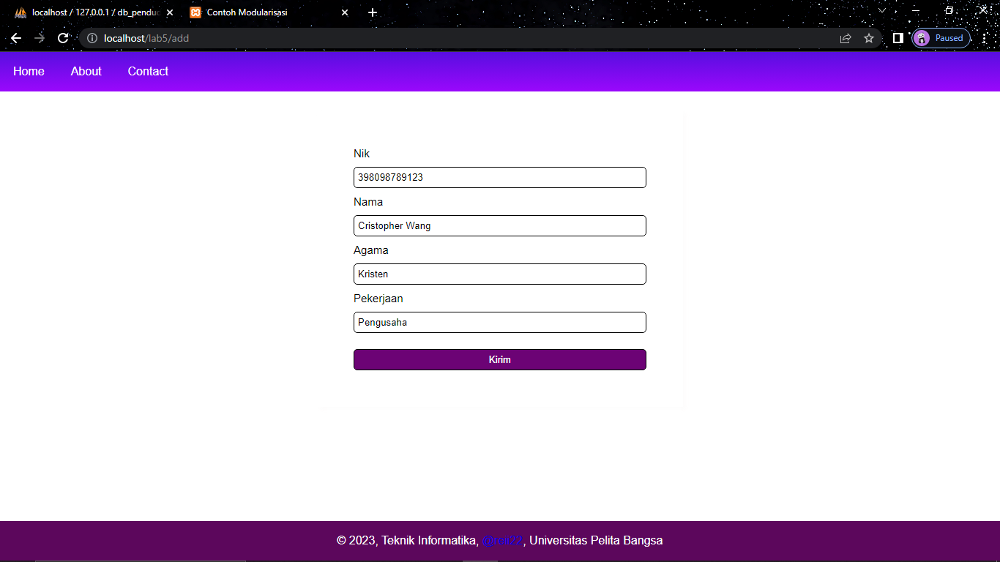
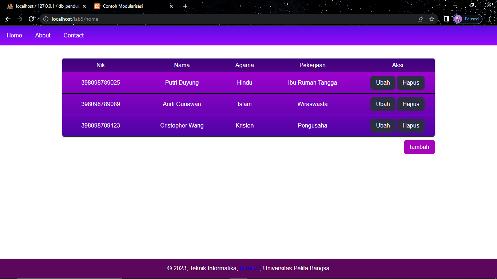
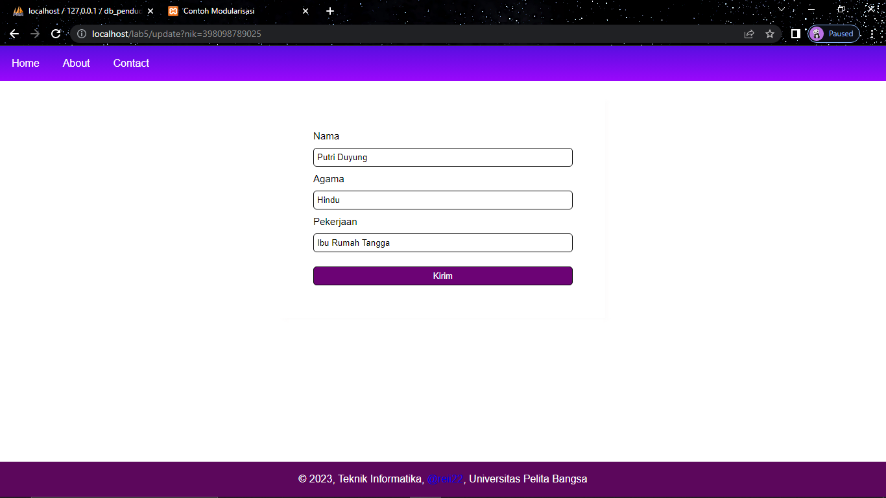

**Nama : Raihan Herfiansyah**  
**Kelas : TI.21.A3**  
**Nim : 312110245**  

### _DataBase :_

  

### _Output :_ 

  

### _Output :_

  

### _Output :_

  

### _Output :_

  

### _Output :_

  